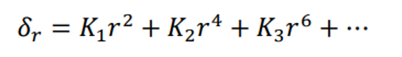
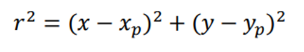
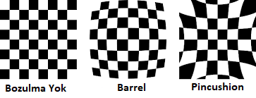
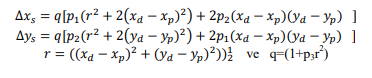
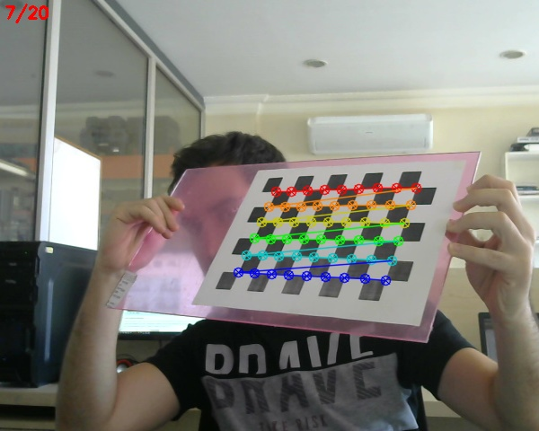
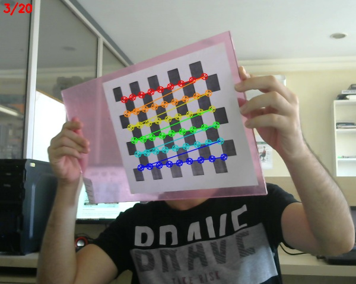

## 1. GÖRÜNTÜ BOZULMALARI

Kameralar belirli görüntü bozukluklarına sahiptir. Görüntü bozuklukları kullanılan kamera, 
lens, açı, ışık vb. gibi birçok etkene bağlı olarak farklı gruplara ayrılırlar. Kameralardaki bu 
görüntü bozukluklarını gidermek için genellikle kameranın iç ve dış parametreleri hesaplanır. 
Bu parametrelere kalibrasyon parametreleri denilmektedir. Kameralarda genellikle Radyal ve 
Teğetsel olmak üzere 2 adet bozulma olmaktadır.

### 1.1. Radyal Bozulmalar

En sık karşılaşılan bozukluklar Radyal bozulmalardır. Radyal bozulmalar genellikle kamera 
lensi kaynaklıdır.

Radyal bozunma eşitliğinde K1,K2,K3,… katsayıları radyal distorsiyon katsayıları olarak 
isimlendirilmektedir. Bu katsayıların etkileri ana noktayla olan mesafenin kuvvetleri ile 
orantılıdır. 

Eşitlikteki mesafenin başlangıç noktası ana noktadır. Ana noktadan görüntü çevresine doğru 
mesafe ile doğru orantılı olarak distorsiyon etkisi devam eder. Ana noktaya olan uzaklık 
aşağıdaki formül ile hesaplanır. 

Radyal bozulmalar kendi içerisinde iki başlığa ayrılmaktadır.

#### 1.1.1. Barrel (Fıçı) Bozulması

Fıçı yaklaşımı bozulması veya varil bozulması olarak adlandırılan bu bozulma şekline en çok 
balık gözü lenslerde rastlanır. Nesneler merkeze doğru yaklaştıkça büyürken kenarlara doğru 
küçülürler.

#### 1.1.2. Pincushion (Yastık/İçbükey) Bozulması

Yastık veya içbükey bozulma olarak adlandırılan bu bozulma şeklinde, merkezden kenara 
doğru gisildikçe düz çizgiler içbükey hale gelir böylelikle bu çizgiler yastık şekli oluşturur.

### 1.1. Teğetsel Bozulmalar

Kameralardaki mercekler üretim aşamasında aynı doğrultuda yerleştirilememektedir. Bu 
doğrultudan sapma nedeniyle teğetsel (tanjant) distorsiyon denilen geometrik yer değiştirmeye 
sebep olacaktır. Teğetsel distorsiyon aşağıdaki denklemler ile hesaplanabilmektedir. 

## 2. KAMERA KALİBRASYONU

Kamera kalibrasyonu; objektif hatalar, fiziksel etkiler gibi dış faktörlerden dolayı bozulmuş 
görüntünün düzeltilerek görüntü işlemeye hazır hale getirilmesidir. Kamera kalibrasyonu 
görüntü koordinat sistemi ile gerçek dünya koordinat sistemi arasındaki ilişkiyi kurmaya 
yardım eder. Kameradan alınan verilerin yüksek hassasiyet gerektiren uygulamalarda 
kullanılması için kameraların mutlaka kalibre edilmesi gerekmektedir. 

Kamera kalibrasyonu işlemi sonucunda hesaplanan parametreler tüm kameralarda farklı 
çıkmaktadır. Bu yüzden hangi kameradaki görüntü düzeltilecekse kamera kalibrasyonunun o 
kamera üzerinde yapılması gerekmektedir. 

Genel olarak, kamera kalibrasyon işlemi, geometrik desenli bir 3B nesnenin (örneğin; satranç 
tahtası) görüntülerini kullanır. Kalibrasyon algoritması, dışsal ve içsel parametreleri kullanarak 
kamera matrisini hesaplar. Dışsal parametreler, 3 boyutlu dünya koordinat sisteminden 3 
boyutlu kameranın koordinat sistemine katı bir dönüşümü temsil eder. İçsel parametreler, 3 
boyutlu kameranın koordinatlarından 2 boyutlu görüntü koordinatlarına dönüştürmeyi temsil 
eder. Kısaca; kamera kalibrasyonunun amacı gerçek dünyadaki 3B noktalar ile 2B noktalar 
(piksel) arasında doğru bir ilişki sağlanmasını sağlar. İçsel ve dışsal parametreler elde edildiği 
zaman kamera kalibre edilmiş olur.

Kamera kalibrasyonu işleminde genellikle satranç tahtası kullanılmaktadır. Bunun nedeni; 
satranç tahtası desenleri farklıdır ve algılaması kolaydır. 

## 3. OPENCV KULLANILARAK KAMERA KALİBRASYONU

Artırılmış gerçeklik uygulamaları ve 3B yeniden yapılandırma gibi birden çok kameralı 
sistemler için manuel kalibrasyonun pratik olmaması ve zaman alıcı olduğu için pek tercih 
edilmemektedir. Bu nedenle otomatik kamera kalibrasyonu için Zhang tarafından önerilen 
yöntem, OpenCV ve Matlab gibi popüler yazılım paketlerindeki açık kaynak uygulaması 
nedeniyle popüler olarak kullanılmaktadır.

Artırılmış gerçeklik uygulamaları ve 3B yeniden yapılandırma gibi birden çok kameralı 
sistemler için manuel kalibrasyonun pratik olmaması ve zaman alıcı olduğu için pek tercih 
edilmemektedir. Bu nedenle otomatik kamera kalibrasyonu için Zhang tarafından önerilen 
yöntem, OpenCV ve Matlab gibi popüler yazılım paketlerindeki açık kaynak uygulaması 
nedeniyle popüler olarak kullanılmaktadır.

### Adım-1:

Bilinen boyuttaki satranç tahtası modeli kullanılarak 3B noktaların gerçek dünya koordinatları
tanımlanır. Yani satranç tahtası görüntüsü çıktı alınır ve her bir kare cm cinsinden ölçülür. Bu 
ölçüm sayesinde gerçek dünyadaki mesafeleri anlamamız kolaylaşacaktır. Daha sonra çıktı 
alınan görüntü düz ve katı bir nesneye yapıştırılır.

### Adım-2:

Satranç tahtasının görüntüleri farklı mesafelerde ve perspektiflerde çekilir. Aşağıda bazı çekim 
işlemleri gösterilmiştir. 

### Adım-3:

Farklı görüntülerdeki her 3B nokta için piksel koordinatlarını bulmak için OpenCV'de bulunan 
findChessboardCorners yöntemi kullanılır. Bu yöntem görüntüde bir satranç tahtası arar. 
Satranç tahtası tespit edilir ise bu satranç tahtası üzerindeki köşe koordinatları döndürülür.

Artık satranç tahtasındaki noktaların dünya koordinatlarındaki 3B konumlarını bildiğimize göre 
2D piksel konumlarını bulabiliriz. cornerSubPix methodu ile en iyi köşe konumu aranır. 

### Adım-4:

OpenCV'de bulunan calibrateCamera yöntemi, 3B noktaları ve piksel koordinatlarını 
kullanarak kamera parametreleri bulunur.

### Adım-5:

Bulunan parametreler kullanılarak görüntüler okunur.
